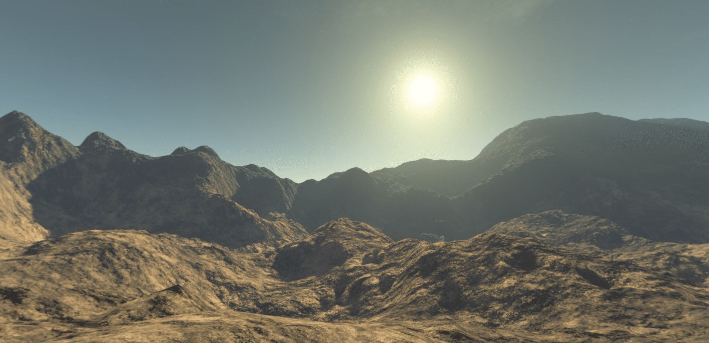

Arid World 3D Model: A Visual Masterpiece by Three.js
=====================================================  

[Live Website](https://utkarshpathrabe.github.io/Arid-World-3D-Model/)  

The Arid World 3D Model, meticulously crafted using the powerful Three.js framework, transports you to a mesmerizing digital landscape. This 3D model is a testament to artistic precision and technological innovation, offering an immersive experience that captures the essence of a desolate, arid world.

## Key Features:

* *Immersive Realism*: Dive into a hyper-realistic desert landscape, where every grain of sand, rock formation and barren vista is authentically recreated.  

* *Interactive Exploration*: Three.js enables users to interact with the model, allowing for zooming, panning and exploration from various angles.  

* *Atmospheric Detail*: Experience the stark beauty of an arid world with meticulously designed lighting, shadows and textures.  

* *Environmental Storytelling*: The model evokes a sense of wonder and curiosity, inspiring contemplation about the mysteries of a desolate world.  

The Arid World 3D Model is more than a digital creation; it's a work of art that invites you to venture into a captivating and thought-provoking environment. Whether you're an artist, a designer, or simply seeking inspiration, this model offers an unparalleled visual experience that transcends the boundaries of technology and creativity.  

  
